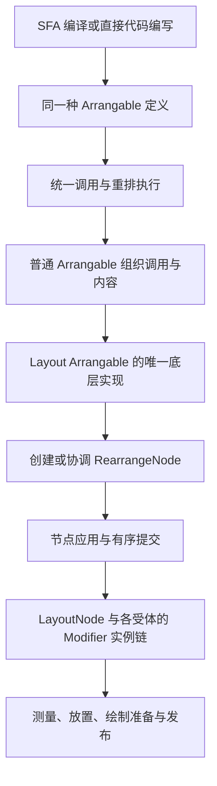

# 目标

Arrange 运行时的目标是让用户用声明式的方式搞 JUCE UI。

运行时以统一的 Arrangable 调用与重排机制组织视图，Layout 是唯一深入节点应用层的 Arrangable。响应式值更新与结构执行分离，后端通过 typed mutation、typed slot update 与 FramePlan 工作。旧 VNode、VNode diff 和 custom renderer 协议应荡然无存。

# Arrangable 与运行时对象

本文是 Arrangable 定义、实例、重排与节点身份的母文档；Foundation 的具体组合见 [内建 Arrangable](12-内建Arrangable.md)，模板语法见 [SFA 与模板写法](33-SFA与模板写法.md)。

| 对象 | 职责与创建边界 |
| --- | --- |
| TemplateNode | SFA 模板的编译期语法节点，表示调用、条件、列表或内容语法；编译为结构程序，不直接构造运行时节点 |
| Arrangable | 视图的组织与包装定义，声明 props、内容入口、初始化及结构实现；SFA 编译与直接代码编写得到同一种定义和调用契约 |
| ArrangableInstance | 一次存续调用的逻辑生命，持有局部状态、输入、上下文、执行作用域与清理职责 |
| RearrangeNode | 唯一由 Layout 实现创建、使用、更新和退休的运行时节点，参与重排协调，关联布局关系、MeasurePolicy、Modifier 及后端实体 |
| LayoutNode | 原生 LayoutTree 中实际参与测量、放置、绘制与命中的布局实体，具有独立身份及代际 |
| RearrangeScope | 可追踪依赖、失效并重新执行一段结构程序的作用域，持有调用匹配与执行所需的账本；作用域边界本身不额外增加实例或节点，执行其中调用时按各自契约创建 |

Arrangable 定义有稳定身份，名称用于解析和诊断，不能代替定义身份。定义注册不创建实例或节点。普通 FA 只是用代码编写的 Arrangable，具有与 SFA 相同的参数、内容、初始化、依赖和生命周期语义；不存在 Foundation 专属能力表、隐藏参数、状态工厂或原生访问权限。

同一个定义可以有多个实例。普通实例通过其内部调用组织零个、一个或多个 Layout；自身不产生 RearrangeNode。一份带循环的源码可以执行多次调用，但只有实际执行到 Layout 才有对应节点。Slot、Template、条件、列表、内容调用和普通包装均不成为 RearrangeNode 的新种类。

setup 按实例执行一次，创建 Ref、computed、ScrollState 等局部状态与资源，并提供可重新执行的结构程序；不需要 remember 保存这些初始化结果。状态与资源由实例或明确的内容作用域拥有，重排只重新执行必要结构，不重新执行 setup。不能为代码 FA 另设 createState/state 生命周期。代码定义和 SFA 编译结果使用同一初始化、结构执行及清理机制，具体内部函数签名不构成公共视图 API。

SFA 编译生成 Arrangable definition TS，组织声明、setup 与结构程序，为调用位置、控制流和内容入口建立稳定的编译位置，并生成 prop getter 与源码定位。编译期不创建实例、作用域或 RearrangeNode；这些对象在执行时按实际存续调用建立。结构程序中的调用返回 void，通过统一执行机制记录调用及输出贡献，不返回待 diff 的节点描述或数组。

# Layout（一个 Arrangable）的唯一特权

Layout 是可由任何 SFA 或代码 Arrangable 调用的正式定义，声明 measurePolicy、modifier 与默认内容。它的调用仍经过同一参数边界、身份匹配和实例生命周期。

只有 Layout 的实现深入 framework 节点管理层。首次执行时建立所属 RearrangeNode，后续执行复用并更新它，退出时执行退休。

一次存续的 Layout 调用管理一个 RearrangeNode。它接收最终组合好的 Modifier 描述，通过节点应用层在关联的 LayoutNode 上协调、物化 Modifier 实例链。普通 Arrangable 可以转交或组合 Modifier，最终接收与应用始终经过 Layout。描述、实例与受体规则见 [Modifier](11-Modifier.md)。

RearrangeNode 与 LayoutNode 不合并身份。前者参与运行时结构协调，后者属于原生执行；保留逻辑内容时，后端实体和 Modifier 实例可以脱离、退休并按当前输入重建，不承诺原生 ID 或 handle 永生。



# 重排的执行与协调

Rearrange／重排包括首次建立、调用身份匹配、输入更新、复用、增删、移动和退休。正式结构程序直接进入统一调用机制，不先构造覆盖全部视图调用的虚拟树，再比较新旧虚拟树。

1. 进入执行作用域，以所属作用域、稳定调用位置、定义身份和 Rearrange key 匹配调用；显式 key 只在所属列表或调用范围内有意义，无 key 时按固定位置与定义匹配
2. 新调用建立 ArrangableInstance 并执行初始化；已有调用复用实例，更新参数与内容词法输入，按实际依赖执行必要结构
3. 执行普通调用、分支、列表和内容时维护其调用与作用域关系；执行 Layout 时由其实现创建或复用 RearrangeNode，更新 Policy、Modifier 及子布局范围
4. 在被执行的范围内协调顺序和退出项；匹配成功的 keyed 移动保留实例及 Layout 所属 RearrangeNode，离开的调用清理子作用域，离开的 Layout 退休节点与关联资源
5. 节点应用层形成必要的原生结构操作与 typed 输入更新，按提交边界交付；后端再执行失效所要求的测量、放置、绘制和命中处理

未重新执行的作用域保留已建立的调用和节点关系，不能因本轮未访问而误退休。定义替换或组合身份改变则退休旧调用，不能因标签名相同强行复用。父子同时失效时先处理父层，取消已退出子作用域的待执行任务，存续子作用域消费最新输入。

执行环境维护最近的所属 Layout 内容范围。普通包装、Slot、Template 与控制流不会增加布局父节点；穿过这些组织层得到的 RearrangeNode 按内容顺序接入正确的父布局。App 挂载提供宿主根容器，不额外冒充用户 Layout 调用或 RearrangeNode。

调用位置、定义与实例、key 索引、活动分支与内容范围、作用域边界属于跨重排存续的调用账本。每个组织范围记录贡献的零个或多个顶层 RearrangeNode；零输出范围仍保留账本中的插入位置，不能仅靠首尾节点定位，也不补原生空盒子或文本锚点。局部重启从所属范围继续协调，无须每轮重建整份账本。账本不能演变为另一棵带 type/props/children、等待通用 patch 的虚拟视图树，也不借 RearrangeNode 名称承载所有控制流；不要求照搬 Compose 的 SlotTable 存储或 gap buffer。源码位置、逻辑实例身份、重排节点身份、原生身份及 Modifier handle 分别管理。

根结构、条件选择、列表与条目、内容调用按职责建立 RearrangeScope。结构读取归当前作用域追踪，嵌套作用域独立订阅；列表范围协调条目顺序，条目范围协调内部结构。keyed 移动保留匹配的实例、作用域与节点，但须刷新 item/index 和实际消费者。普通固定调用不必各建一个独立 effect，只有需要独立重启的结构边界才承担相应追踪与调度职责。

值绑定独立追踪输入依赖。纯值变化可以直接更新已有 Policy 或 Modifier 实例参数，不执行结构重排；只有结构消费者失效才执行相关结构程序。测量、放置、绘制不计入重排次数。作用域失效、帧授权与提交次序见 [调度线程与帧阶段](26-调度线程与帧阶段.md)。

失败不能发布半成品或发送成功生命周期通知。新建实例、节点、绑定与资源必须有清理归属，已退休目标拒绝迟到写入；候选结果失败时保留上一成功发布帧。提交机制见 [LayoutTree 与 NativeTransaction](15-LayoutTree与NativeTransaction.md)。

重排采用事务式提交：执行时准备候选调用账本、输入连接和节点操作，已提交范围继续保有其身份与资源。AB → AC 只有 C 初始化及整次原生 apply 成功后，才能以候选 AC 替换已提交 AB 并 forget/dispose B；不能在遍历时因 B 未被访问就提前释放它。创建、求值或 apply 失败时丢弃本轮候选，清理本轮新建对象，保留已提交 AB，即使错误已被用户捕获也一样。提交结果必须从真实应用边界反馈，FFI 排队完成不是 apply 成功；框架只撤销自身候选操作，不承诺回滚用户业务副作用。

候选期间保留旧订阅，失败恢复框架管理的参数值、闭包和输入缓存，并清理候选订阅；成功才退休退出项。同批参数先独立求值、整组校验，再交付消费者，避免观察半组新输入。提交后清理或成功通知抛错不撤销已成功的提交，剩余清理及通知仍须执行。

# 内化的 prop 延迟求值

内部每个 prop 统一以 `() => T` 交付，包括常量、动态表达式、业务回调和原样 Ref；不存在 arrangeValue/ValueExpression 包装或裸值兼容分支。用户声明结果类型，读取 `props.x` 得到 T，getter 是编译与运行时的内部协议。回调 prop 的外层 getter 只返回 callable，不执行业务回调；原样 Ref 返回同一容器，不读取其 `.value`。

参数值消费者独立管理依赖、校验、缓存、相等结果抑制和退休，不能在父结构中批量取值而将全部依赖收进同一个 RearrangeScope。props 门面保持稳定，实际读取者按结构或值用途订阅。可证明的常量每次存续调用只初始化求值一次，缓存归实例或绑定；getter 无响应式读取不等于永久不变，列表词法输入、内容环境或参数来源替换时须刷新求值与旧依赖。无捕获函数可以复用，不能跨实例共享可变默认结果。

编译器在原表达式位置保留延迟性，参数名称与形状检查和字段值消费分开。动态参数对象遵守 JS 求值顺序与副作用语义，不假装能从已经求得的值还原表达式。固定 Modifier 链可细分参数消费，但仍接入同一协议；后端收到通过校验的 typed 值，不在绘制线程执行 JS getter。

固定形状调用的参数计划在 setup 连接正式定义、声明位置与内容名称，不执行 getter 或默认值工厂；真实调用时按位置连接独立值消费者。可缓存的 getter、参数对象和内容描述在所属初始化范围内复用；列表及内容的词法捕获仍须随其输入刷新。动态对象的形状消费者与字段值消费者分开，相同形状的字段变化无需重启结构。

# 原生、FFI 与生命周期驱动

Layout 所属 RearrangeNode 经节点应用与有序提交关联原生 LayoutNode；原生负责实体关系、代际、Modifier 实例链及测量、放置、绘制。QuickJS/C++ 的同进程 FFI 交付 typed 操作、值与事件，并维护跨边界引用和代际，不拥有另一套视图树或布局语义，不自行启动帧。

实例与作用域决定存续、停用、恢复和退休，Owner/调度器决定执行时机。结构和值任务按所属生命排队、取消并进入提交；成功生命周期通知依对应提交结果发出，FFI 调用返回不代表屏幕呈现。setter 不立即布局，退休目标拒绝迟到任务；时序细则以 [调度线程与帧阶段](26-调度线程与帧阶段.md) 为准。

# 输入

- 编译后的 App 入口脚本与 SFA。
- Arrange host arrangables、Modifier、基础类型与动画 API。
- 用户业务状态、Arrangable结构状态与 UI value state。
- native 输入、资源、diagnostics、reload、HMR、VBlankSource tick 等 typed event。

# 输出

- `MutationTransaction`：布局结构、Policy、Modifier、event slot 等离散界面变更。
- `SlotUpdateBatch`：layout / draw / event / resource 等 typed UI slot 更新。
- typed runtime state change。
- typed invalidation。
- FramePlan 所需输入。

# Arrange 在 TS 侧的 Runtime

这运行时包含：

```txt
Rearrange runtime
Phase-aware reactivity
Reactive Slot Runtime
JS Value Phase scheduler
HMR / reload runtime integration
```

核心原则：

```txt
Ref 的被使用情况决定它的失效阶段。
```

结构消费者失效进入重排阶段（现有帧阶段称 Rearrange Phase）；layout、draw、event、resource 等 UI slot 变化进入对应 slot update；高频动画值进入 JS Value Phase，不默认触发重排。

# Reactive Slot Runtime

Reactive Slot Runtime 负责把 UI 值绑定到明确节点字段、Modifier 字段、event slot 或 resource slot：

```txt
Ref / computed / animatedXAsRef
-> typed UI slot binding
-> dirty slot batch
-> FramePlan
```

slot 必须携带：

```txt
node id / scene id
slot kind
field path
dirty role
current typed value
reason / source
```

典型 dirty role：

```txt
Layout
Draw / Paint
Transform
HitTest
Event
Resource
Accessibility
```

# VBlankSource 与动画刷新

生产视觉帧源只有 `JuceVBlankSource`。它由 JUCE `VBlankAttachment` 或等价 platform display-frame source 驱动。`VBlankReady` 是 visible UI runtime ready 的必要条件。

没有 `VBlankReady` 时，runtime 可以准备 App、pending transaction、pending slot update 与 diagnostics state，但不得推进 visual frame、动画 tick、SceneFramePipeline visual publish 或 repaint pump。

帧更新链路固定为：

```txt
VBlank tick
-> InputIntent drain
-> Rearrange Phase if needed
-> JS Value Phase if needed
-> FramePlan
-> Native Render Phase / SceneFramePipeline
-> PublishedFrame
-> passive paint
```

动画链路固定为：

```txt
VBlank tick
-> JS Value Phase
-> animated refs / transitions advance
-> typed slot dirty
-> SlotUpdateBatch
-> FramePlan
-> SceneFramePipeline
```

动画过程值变化不得默认触发结构重排。动画下一帧必须回到 VBlankSource。Promise / microtask、JS timer 或 production timer fallback 都不能承担 frame 语义。

# 运行时提交边界

`native.beginRearrange()` / `native.submitRearrange()` 表达候选提交与完成回执，结构和值操作保留同一因果顺序。具体类型化边界见 [LayoutTree 与 NativeTransaction](15-LayoutTree与NativeTransaction.md)，提交入口不得在调用栈内直接执行测量、放置、绘制或发布。

reload、HMR reload、unmount、错误恢复和 source 切换必须清理旧 App 的 pending callbacks、pending transactions、slot bindings 与 slot update batch。

运行时不得把 JS callback、RAF callback、reload、resize、diagnostics、resource ready 或 package load 直接转成输出阶段。它们必须先进入 InputIntent、RuntimeStore、MutationTransaction 或 SlotUpdateBatch，再由 FramePlan 决定输出。

# 其余关联项

[调度线程与帧阶段](26-调度线程与帧阶段.md)；[LayoutTree与NativeTransaction](15-LayoutTree与NativeTransaction.md)；[SFA 与模板写法](33-SFA与模板写法.md)；[互操作](16-互操作.md)；[事件系统](17-事件与输入.md)。


