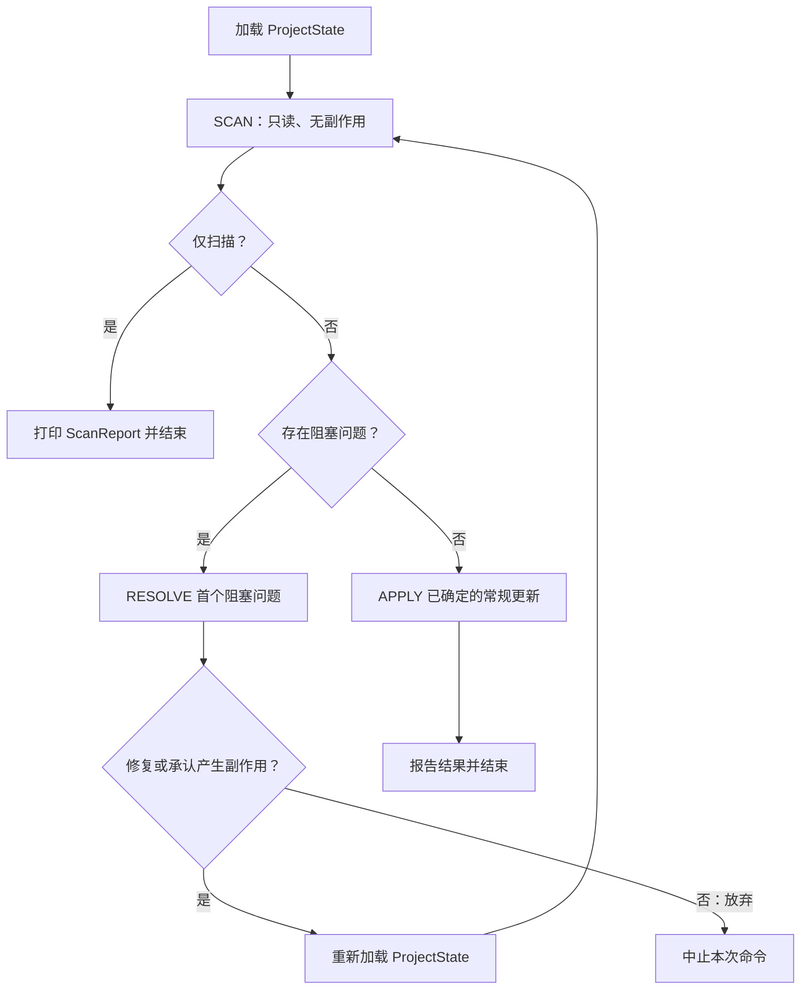
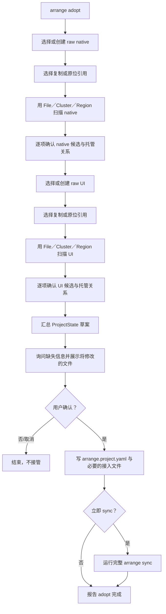
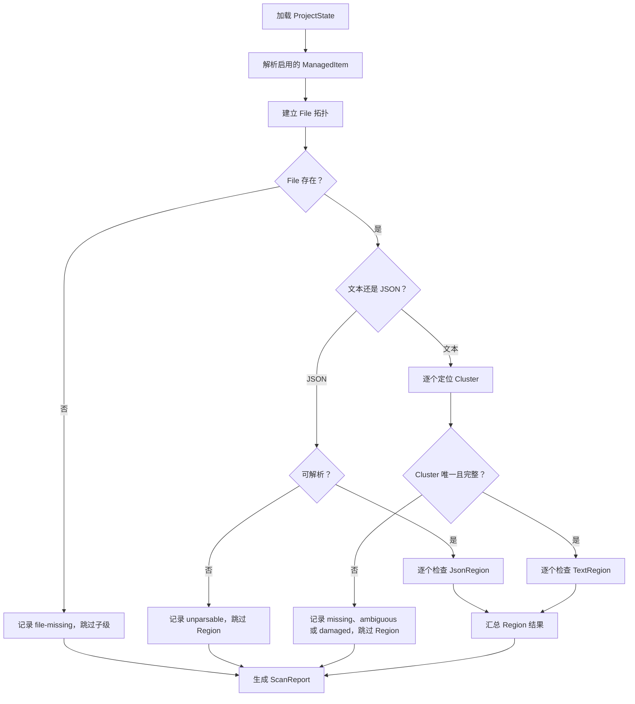
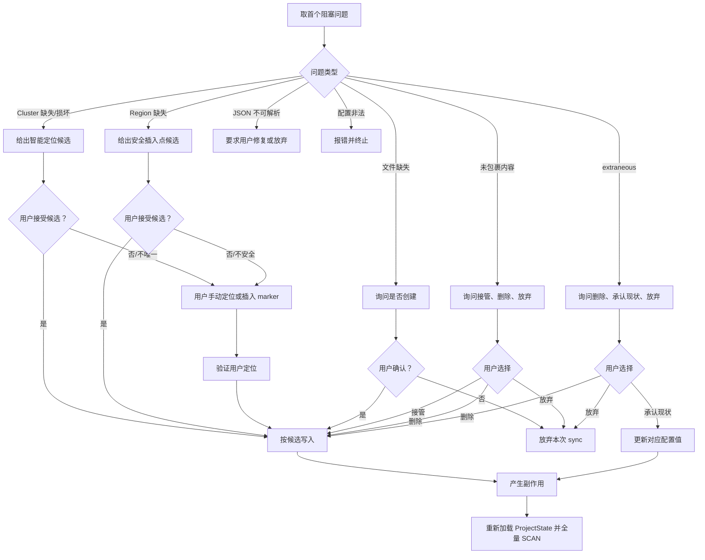
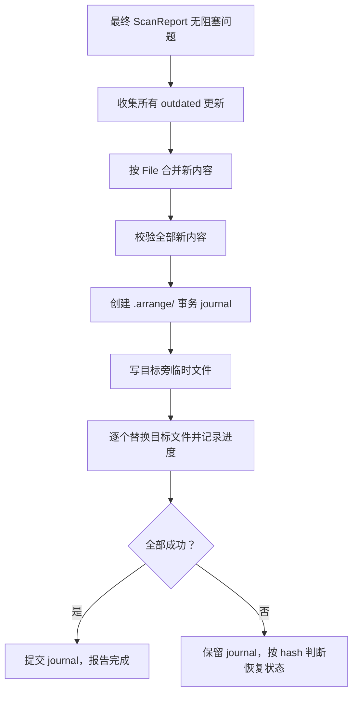
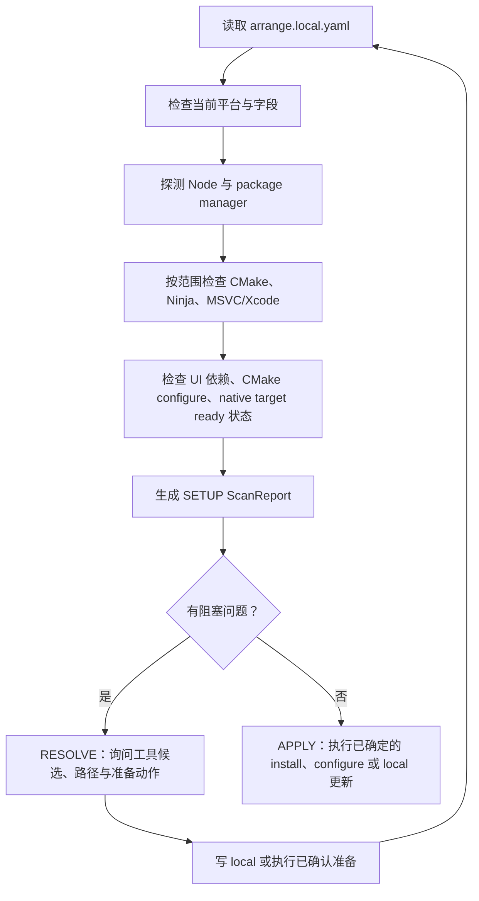
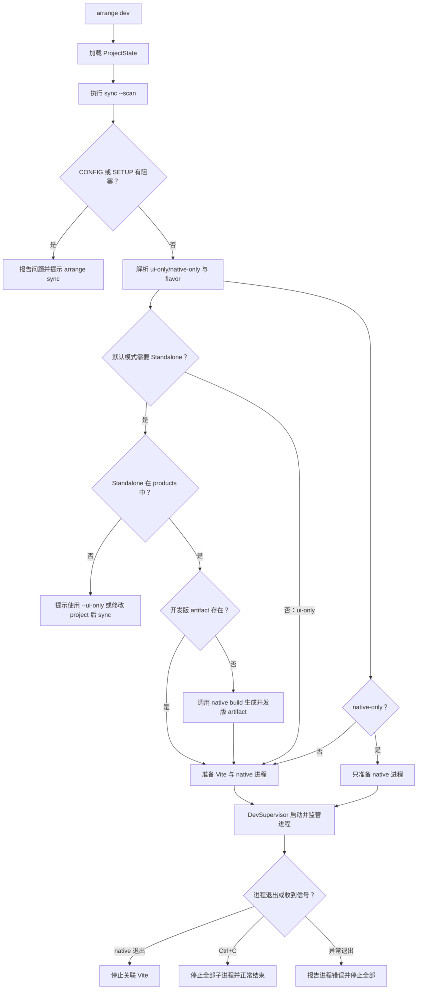
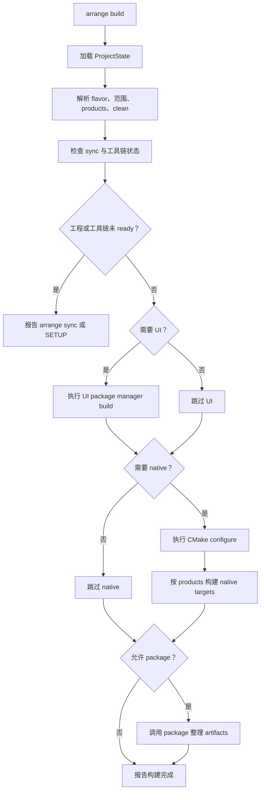
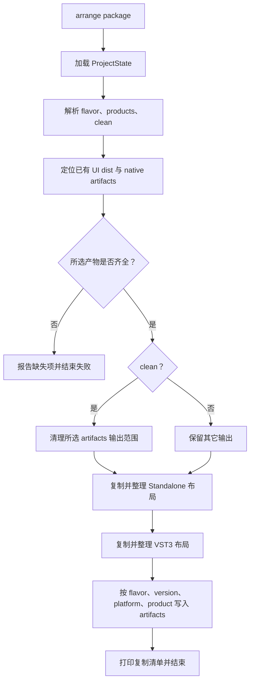

# M2.2 命令定义与执行流程

本文是 M2.2 CLI 重写期间的详细命令施工规格。长期的用户可见契约见 [Arrange CLI 与工程模式](../../../arch/31-ArrangeCLI与工程模式.md)，File／Cluster／Region、ManagedItem 和同步状态机见 [Arrange CLI 托管与同步模型](../../../arch/32-ArrangeCLI托管与同步模型.md)。本文负责回答一件事：每条命令按什么顺序做什么、在哪里询问用户、什么情况下结束。

## 总原则

1. 命令少，语义确定；参数只表达本次动作的范围和输出风味。
2. 长期工程事实进入 YAML，命令参数不承担复杂配置。
3. 既有工程命令都在当前 Arrange 工程根执行，不向上寻找 root，不提供 `--cwd`、`--root`；create 与 adopt 负责建立工程根。
4. 交互使用 Clack；配置使用 Zod；YAML 使用 `yaml` 库。
5. create、adopt、sync、build、dev、package 共用 ProjectState 与 File／Cluster／Region 定义，不维护第二套生成或扫描语义。
6. CONFIG 与 SETUP 都遵循同一状态机：



SCAN 不创建文件、不修改 YAML、不运行外部命令。RESOLVE 的每个自动候选都必须征得用户同意；写入文件或改配置后重新扫描，不能手工补造级联结果。APPLY 只处理已经没有决策歧义的更新，例如 outdated 内容。

## 命令面

```bash
arrange create [--registry <url>] [--fetch-content <url>]
arrange adopt  [--registry <url>] [--fetch-content <url>]
arrange sync   [--scan] [--config | --setup] [--ui | --native]
arrange dev    [--ui-only | --native-only] [--flavor debug|release]
arrange build  [--flavor debug|release] [--ui-only | --native-only] [--no-package] [--product standalone|vst3]... [--clean]
arrange package [--flavor debug|release] [--product standalone|vst3]... [--clean]
```

`--config` 与 `--setup` 互斥；`--ui` 与 `--native` 互斥。省略范围表示全部。`sync --scan` 只扫描并打印报告；发现问题时以非零状态结束。

---

## `arrange create`

### 目标

创建标准 Arrange 工程，写入共享配置和初始 UI/native 文件，并建立用户选择的托管策略。create 不能另行维护一套 scaffold 规则；文件生成必须委派 File、Cluster、Region。

### 交互输入

向导收集：

- 创建位置：当前目录或项目名子目录。
- project name、project version。
- Arrange framework version。
- vendor name、vendor code、plugin code。
- plugin type：`effect` 或 `instrument`。
- UI package manager：`pnpm` 或 `npm`。
- products：`standalone`、`vst3`。
- UI、native、artifacts 目录。
- 各 ManagedItem 是否启用。
- 可选 framework registry 和 CMake FetchContent URL。

生成时未启用托管的 Region 仍可以产生一次性普通内容，但不写 wrapper，也不加入后续 sync 的托管拓扑。

### 流程

```mermaid
flowchart TD
    A[arrange create] --> B[启动交互向导]
    B --> C[选择工程根与目录]
    C --> D[填写项目、framework、UI、native 信息]
    D --> E[选择 products 与 ManagedItem]
    E --> F[展示完整摘要]
    F --> G{用户确认？}
    G -->|否/取消| H[结束，不写工程]
    G -->|是| I[构造 ProjectState]
    I --> J[File.create(state)]
    J --> K[Cluster.create(state)]
    K --> L[Region.render(state, managed)]
    L --> M[写 arrange.project.yaml、初始文件与 .gitignore]
    M --> N{立即 sync？}
    N -->|否| O[报告创建完成]
    N -->|是| P[运行完整 arrange sync]
    P --> O
```

### 完成条件

- 工程根有 `arrange.project.yaml`。
- 按配置生成 `ui/`、`native/` 和必要的初始文件。
- `arrange.local.yaml` 尚未准备时，由后续 sync 的 SETUP 处理。
- create 生成的内容与后续 sync 使用同一套 File／Cluster／Region 定义。

---

## `arrange adopt`

### 目标

把已有 UI/native 工程收编到 Arrange 工程模式。adopt 可以后做，但接口必须从现在开始兼容它：识别、定位、确认和托管都不能依赖 create 专用旁路。

### 输入与识别

#### native

- 新建 native，或复用已有 native。
- 复用时选择复制到工程，或原位引用。
- 扫描 CMakeLists、FetchContent、JUCE plugin target、link、source layout。
- 识别 project name、version、product、plugin type 等候选。

#### UI

- 新建 UI，或复用已有 UI。
- 复用时选择复制到工程，或原位引用。
- 扫描 package.json、lockfile、package manager、已有 scripts、framework dependency 和 `.npmrc`。

所有检测结果都是候选，不是静默决策。不能可靠识别的内容要询问用户；不能安全接管的结构可以让用户手动放置 marker 或选择不托管。

### 流程



### 完成条件

- 共享配置完整且通过 schema 校验。
- 用户确认的工程文件已接入相应托管关系。
- 不确定的文件结构没有被猜测性覆盖。
- 后续 sync 可以直接复用 adopt 建立的拓扑。

---

## `arrange sync`

### 形态

```bash
arrange sync [--scan] [--config | --setup] [--ui | --native]
```

### 范围解析

| 参数 | 语义 |
|---|---|
| 无 `--config`、`--setup` | CONFIG + SETUP |
| `--config` | 只处理 CONFIG |
| `--setup` | 只处理 SETUP |
| 无 `--ui`、`--native` | UI + native |
| `--ui` | 只处理 UI 相关项 |
| `--native` | 只处理 native 相关项 |
| `--scan` | 只执行 SCAN，不 RESOLVE、不 APPLY |

### CONFIG SCAN

CONFIG SCAN 只观察项目文件和配置：



SCAN 产生 `idle`、`outdated`、`missing`、`unwrapped-existing`、`extraneous`、`wrapper-damaged`、`config-invalid` 等结果。父级问题存在时，子级只能是 skipped，不得伪造结果。

### CONFIG RESOLVE

RESOLVE 每次只处理报告中的首个阻塞项：



“承认现状”只更新用户明确承认的配置事实。若一个 ManagedItem 关联多个 Region，不隐式关闭其它 Region。

### CONFIG APPLY

无阻塞问题后，APPLY 只处理确定的常规更新：



APPLY 不再做决策，也不为 outdated 逐项启动 RESOLVE。`.arrange/` 只保存本机事务和未来缓存，不提交 Git。

### SETUP

SETUP 的扫描、解决和应用也遵循同一状态机：



SETUP 不静默修改全局 PATH；工具候选不唯一时询问用户。Windows native 命令必须使用已验证的 Visual Studio Developer Command Prompt 环境。

---

## `arrange dev`

### 目标

拉起开发环境和测试程序。dev 可以为缺失的开发版 native artifact 执行正式构建，但不静默修改工程托管配置。

### 流程



默认 dev 启动 Vite 与 Standalone；`--ui-only` 只启动 Vite；`--native-only` 只启动 native 开发程序。Ctrl+C 是正常结束，不应渲染为错误。

---

## `arrange build`

### 目标

构建可用的 UI/native 产物。默认 flavor 为 `release`，默认 products 来自 ProjectState；完整构建默认继续进入 package，`--no-package` 可关闭。

### 流程



`--ui-only` 不执行 native，也不 package；`--native-only` 不执行 UI，也不 package；`--no-package` 只跳过 package。`--clean` 清理行为只作用于本次明确选择的构建范围。

---

## `arrange package`

### 目标

只整理已有的 UI/native 构建产物，不 install、不 configure、不 build。

### 流程



默认布局为 `artifacts/<flavor>/<version?>/<platform>-<arch>/<product>/`。VST3 的 UI 资源放入对应 bundle 的约定资源目录；具体路径由 ArtifactLocator 根据平台和实际产物确认。

---

## 不加入本期命令面的内容

本期不增加 `doctor`、`status`、`clean`、`inspect` 等并列命令。它们未来可以复用 ScanReport、SETUP 和 `.arrange/`，但不能在 M2.2 重写期间另造一套诊断或清理语义。

## 实现顺序

1. 统一 `ProjectState`、路径解析和服务依赖，使新版 CLI 通过 typecheck。
2. 落地 File／Cluster／Region／ManagedItem 与物理／逻辑拓扑。
3. 实现 `sync --scan --config` 的门控扫描和报告。
4. 实现 CONFIG RESOLVE：智能定位、手动定位、删除、承认、放弃和全量重扫。
5. 实现 CONFIG APPLY 与 `.arrange/` journal。
6. 让 create 复用统一生成链。
7. 实现 SETUP，再接入 build、dev、package。
8. 最后实现 adopt 的识别与接管流程。

## 完成判据

- 每条命令的流程与本文件 Mermaid 图互相对应。
- SCAN 没有副作用；任何 Resolve 副作用后都重新加载 state 并全量扫描。
- create 与 sync 没有第二套文件生成规则。
- `extraneous` 支持删除、承认现状、放弃。
- build、dev、package 都通过统一的 sync／setup 状态和执行器工作。