# M2.2 命令定义与执行流程

本文是 CLI 重写期间的命令执行规格。命令与工程形态见 [Arrange CLI 与工程模式](../../../arch/31-ArrangeCLI与工程模式.md)；定义、扫描矩阵与 LSRA 语义见 [托管与同步母文档](../../../arch/32-ArrangeCLI托管与同步模型.md)。本文用 Mermaid 明确命令顺序、交互位置和退出分支，不重复矩阵定义。

## 命令入口

命令和参数定义见 [CLI 母文档](../../../arch/31-ArrangeCLI与工程模式.md#命令)。本期交互使用 Clack，配置校验使用 Zod，YAML 使用 `yaml` 库。

## `arrange create`

### 目标与交互输入

创建标准 Arrange 工程，写入共享配置和初始 UI/native 文件。向导收集：

- 创建位置：当前目录或项目名子目录。
- project name、project version、Arrange framework version。
- vendor name、vendor code、plugin code。
- plugin type：`effect` 或 `instrument`。
- UI package manager：`pnpm` 或 `npm`。
- products：`standalone`、`vst3`。
- UI、native、artifacts 目录。
- 各 ManagedItem 是否启用。
- 可选 framework registry 和 CMake FetchContent URL。

生成接口见[托管模型](../../../arch/32-ArrangeCLI托管与同步模型.md#物理定义接口)。

### 流程

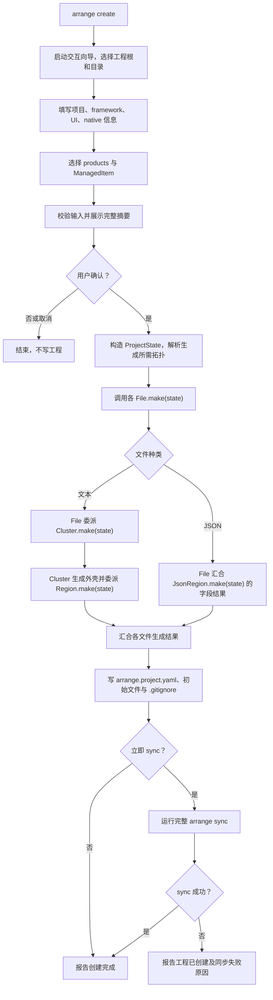

### 完成条件

- 工程根有合法 `arrange.project.yaml`，按配置生成所需 UI/native 初始文件。
- create 的生成结果与后续 CONFIG 使用同一套定义。
- local 尚未准备时由后续 SETUP 负责；选择立即 sync 不意味着同步必然成功。

## `arrange adopt`

### 目标与输入

收编已有 UI/native 工程。保持选择新建或复用、复制或原位引用的交互；项目已在 CWD 对应位置时不重复复制，目录名不同于默认值时可询问是否改名。

native 由用户明确目录、目标和项目配置，不分析 CMake 正文来反推字段或定位区块。UI 可读取 package.json 等结构化文件展示现状，由用户提供并确认工程配置。选择托管的文本内容通过同一套 Wrapper/Marker 交互接入，不恢复旧的智能文本候选或反哺配置流程。

### 流程

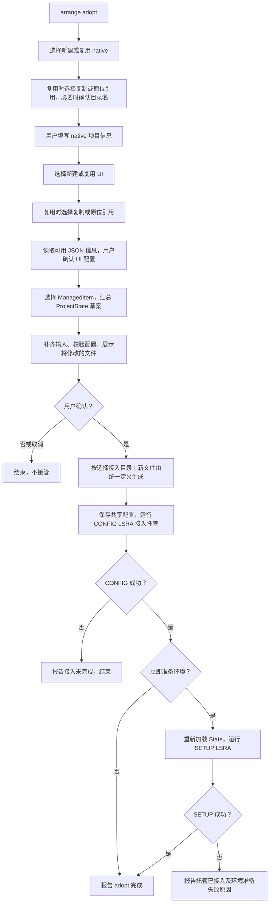

### 完成条件

- 配置完整并经用户确认，所选托管通过 CONFIG 接入。
- 既有文本区块通过用户指定的 Wrapper 建立定位，未托管内容不被接管。
- 后续 sync 从保存的 State 推导拓扑，不依赖 adopt 的一次性内存坐标。

## `arrange sync`

参数选择见 [CLI 母文档](../../../arch/31-ArrangeCLI与工程模式.md#命令)。

### 完整同步编排

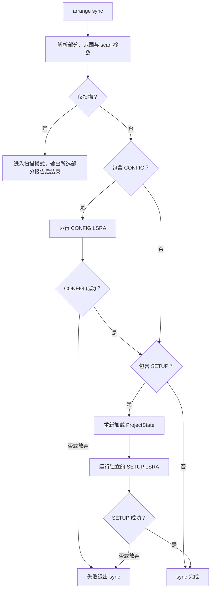

### CONFIG LSRA

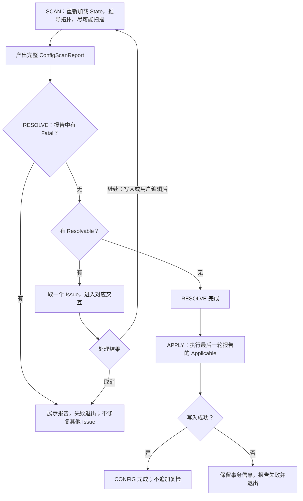

### CONFIG SCAN 的遍历

父级门控与四类结果使用[母文档的扫描矩阵](../../../arch/32-ArrangeCLI托管与同步模型.md)，下图展开当前扫描器的遍历顺序。

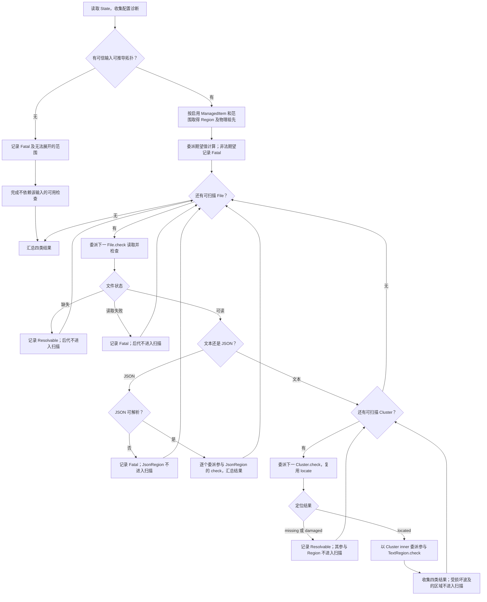

期望非法和父级失败都只阻断依赖该输入的判定；其他具有可信输入的对象继续扫描。报告引用与验收示例见 [SCAN 结果各项与对策](SCAN结果各项+对策.md)。

### CONFIG RESOLVE 的一次交互

此处的入口已经通过 Fatal 检查。每次只处理一个 Resolvable；所有编辑返回完整 SCAN，不继续消费旧报告。

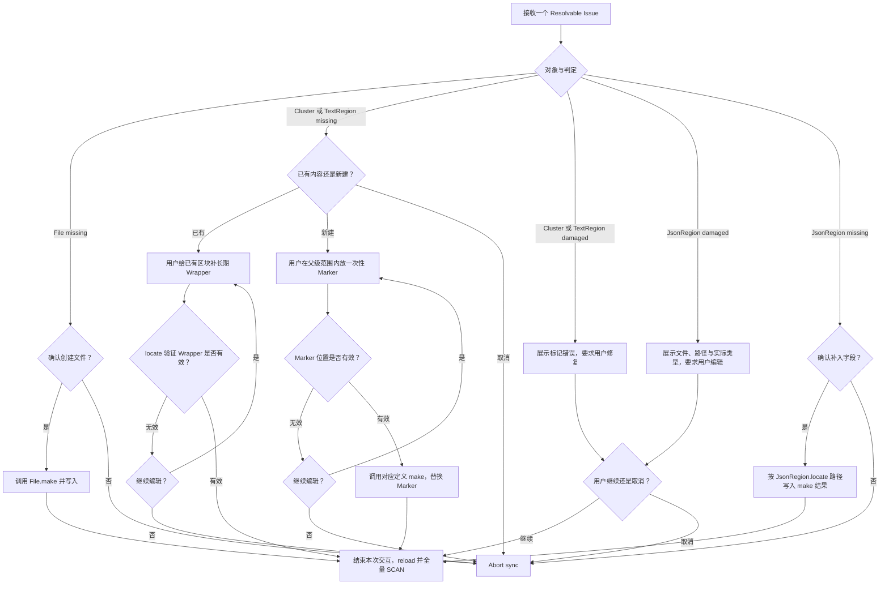

若发现用户在交互期间同时修改了 YAML，结束当前 Issue 的交互并回到完整 SCAN，不再依据旧 expect 或旧托管开关写入。位置验证不通过时不写入，用户可修复或取消。对应处理的语义边界以母文档为准。

### CONFIG APPLY

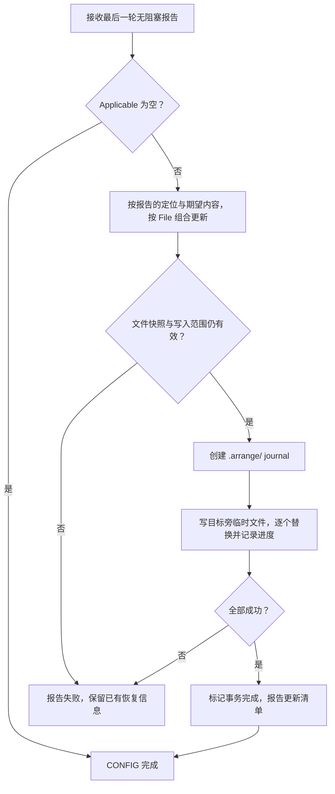

区间换算与替换规则见[恢复与应用](../../../arch/32-ArrangeCLI托管与同步模型.md#config-的恢复与应用)，写入保护见[事务约定](../../../arch/32-ArrangeCLI托管与同步模型.md#arrange-与写入失败)。

### 扫描模式

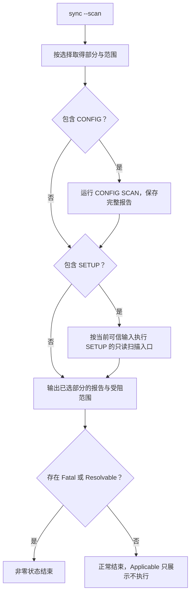

SETUP 在扫描模式中观察当前实际状态，不假定 CONFIG 的 Applicable 已被执行；无法开展的范围必须说明。其具体扫描项目与分类仍待后续设计。

### SETUP 的已定边界

SETUP 管环境和设施准备状态，使用项目需求与本机设置，运行独立 LSRA。完整 sync 中，它在 CONFIG 成功并重新加载 State 后开始。

本轮不规定工具探测、依赖安装、CMake configure 等动作分别属于哪个阶段，也不保留旧稿中未经确定的详细对策图。后续设计应补充 SETUP 自己的扫描矩阵和交互流程，再实现该部分。

## `arrange dev`

### 目标

拉起开发环境和测试程序。dev 可以为缺失的开发版 native artifact 执行正式构建，但不静默修改工程托管配置。

### 流程

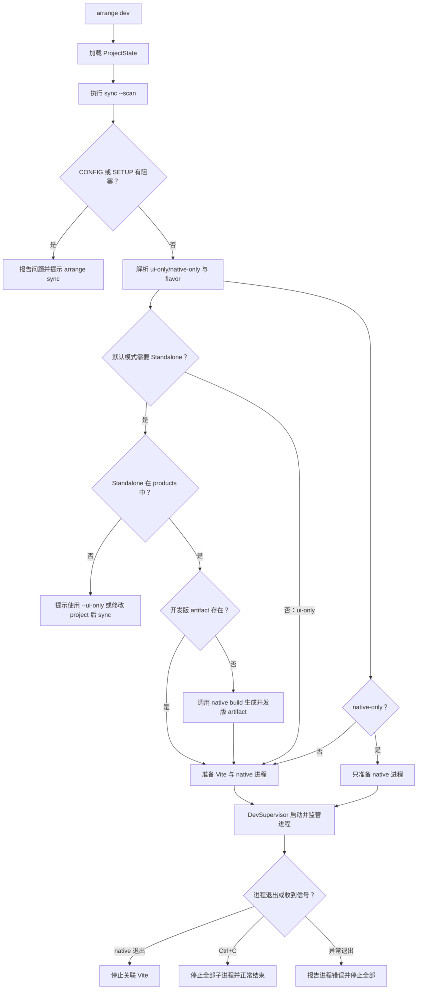

默认 dev 启动 Vite 与 Standalone；`--ui-only` 只启动 Vite；`--native-only` 只启动 native 开发程序。Ctrl+C 是正常结束，不应渲染为错误。

---

## `arrange build`

### 目标

构建可用的 UI/native 产物。默认 flavor 为 `release`，默认 products 来自 ProjectState；完整构建默认继续进入 package，`--no-package` 可关闭。

### 流程

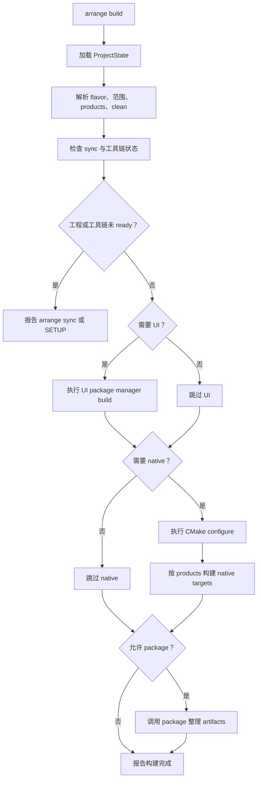

`--ui-only` 不执行 native，也不 package；`--native-only` 不执行 UI，也不 package；`--no-package` 只跳过 package。`--clean` 清理行为只作用于本次明确选择的构建范围。

---

## `arrange package`

### 目标

只整理已有的 UI/native 构建产物，不 install、不 configure、不 build。

### 流程

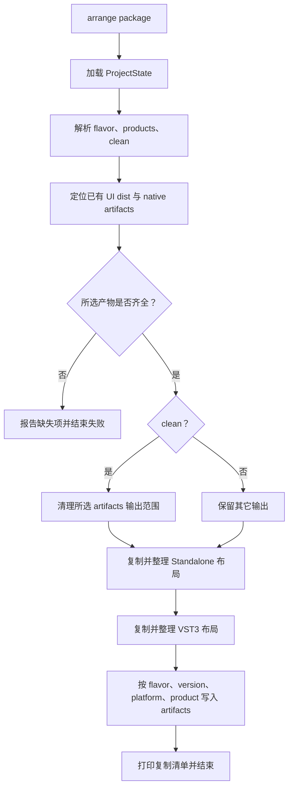

默认布局为 `artifacts/<flavor>/<version?>/<platform>-<arch>/<product>/`。VST3 的 UI 资源放入对应 bundle 的约定资源目录；具体路径由 ArtifactLocator 根据平台和实际产物确认。

---

## 不加入本期命令面的内容

本期不增加更多命令。未来诊断入口复用同一套定义、报告和准备状态，不另造文件检查或生成规则。

## 后续施工入口

当前进度与实现顺序见[第三期工作区](第三期M2.2的工作.md)，模型接口见[托管母文档](../../../arch/32-ArrangeCLI托管与同步模型.md#物理定义接口)。SETUP 的具体 LSRA 待讨论。

## 完成判据

- 命令实现与对应 Mermaid 流程一致，失败、取消与扫描模式有明确出口。
- CONFIG 满足[报告验收案例](SCAN结果各项+对策.md)，特别是完整收集四类结果、父级阻断后不扫描子项、每轮只修一个 Issue 和重扫。
- create/adopt 复用统一定义，受管文本以 Wrapper 定位，不引入正文反向解析。
- SETUP 在自己的后续规格确定后单独验收，不把 CONFIG 的矩阵直接当作其实现。
